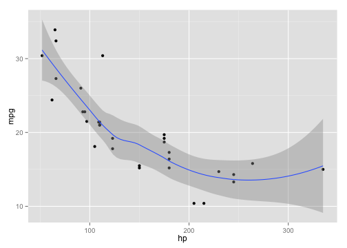

## Description

Application requirements:

1. Some form of input (widget: textbox, radio button, checkbox, ...)
2. Some operation on the ui input in sever.R
3. Some reactive output displayed as a result of server calculations
4. You must also include enough documentation so that a novice user could use your application.
5. The documentation should be at the Shiny website itself.


## Components

<table>
        <tr>
        <td><b>Component</b></td>
        <td><b>Description</b></td>
        </tr>
        <tr>
        <td>ui.R</td>
        <td>user-interface definition of a Shiny web application.</td>
        </tr>
        <tr>
        <td>server.R</td>
        <td>logic for a Shiny web application</td>
        </tr>
        </table>


--- &twocol

## Functionality ui.R

*** =left
In the ui.R the user has tow parts:

**1. Side Bar: has the option to choose:**

  - **Select a dataset**: iris, mtcars or trees.
  - **Select two variables**: X and Y variables.
  - **Select density**: from 50 to 250.
  - **Select a colour** for the graphs.
  - **Select one type of graph**:
    - Bar Plot.
    - Box Plot.
    - Dot Plot.
    - Line Chart.
    - Scatter Plot.

*** =right
**2. mainPanel: has a tabPanel with:**
  - **Dinamyc Plot**: shows the selected graphic created with the information of the selected dataset.
  - **Structure**: shows the selected dataset structure.
  - **Summary**: shows the selected dataset summary.
  - **Data**: shows the dataof the X variable.


---

## Server and Libraries
In the server.R are:

<table>
        <tr>
                <td>**Variable**</td>
                <td>**Functionality**</td>
        </tr>
        <tr>
                <td>colm</td>
                <td>contains the value of selected dataset</td>
        </tr>
        <tr>
                <td>var</td>
                <td>contains the names of the columns of the selected dataset.</td>
        </tr>
        <tr>
                <td>dataset</td>
                <td>contains the selected dataset.</td>
        </tr>
        <tr>
                <td>graph</td>
                <td>contains the selected graphic.</td>
        </tr>
</table>

### Libraries:

`shiny` , `ggplot`, `car`, `RcppEigen`


--- .class #id

## Embedded Code


```r
library(ggplot2)
qplot(hp, mpg, data=mtcars)+geom_smooth()
```

 
[Shiny Application](https://sigma360.shinyapps.io/shinyproject_coursera/)


--- .class #id

## Interactive Information 
<div class="row-fluid">
  <div class="col-sm-4">
    <form class="well">
      <div class="form-group shiny-input-container">
        <label class="control-label" for="dataset">Choose Dataset</label>
        <div>
          <select id="dataset"><option value="iris" selected>iris</option>
<option value="mtcars">mtcars</option>
<option value="trees">trees</option></select>
          <script type="application/json" data-for="dataset" data-nonempty="">{}</script>
        </div>
      </div>
      <div class="form-group shiny-input-container">
        <label class="control-label" for="type">Choose Type</label>
        <div>
          <select id="type"><option value="Summary" selected>Summary</option>
<option value="Structure">Structure</option></select>
          <script type="application/json" data-for="type" data-nonempty="">{}</script>
        </div>
      </div>
    </form>
  </div>
  <div class="col-sm-8">
    <pre id="sumstr" class="shiny-text-output"></pre>
  </div>
</div>


--- &interactive

## Interactive Chart 

<div id = 'chart1' class = 'rChart nvd3'></div>
<script type='text/javascript'>
 $(document).ready(function(){
      drawchart1()
    });
    function drawchart1(){  
      var opts = {
 "dom": "chart1",
"width":    800,
"height":    400,
"x": "hp",
"y": "mpg",
"group": "carb",
"type": "multiBarChart",
"id": "chart1" 
},
        data = [
 {
 "mpg":             21,
"cyl":              6,
"disp":            160,
"hp":            110,
"drat":            3.9,
"wt":           2.62,
"qsec":          16.46,
"vs":              0,
"am":              1,
"gear":              4,
"carb":              4 
},
{
 "mpg":             21,
"cyl":              6,
"disp":            160,
"hp":            110,
"drat":            3.9,
"wt":          2.875,
"qsec":          17.02,
"vs":              0,
"am":              1,
"gear":              4,
"carb":              4 
},
{
 "mpg":           22.8,
"cyl":              4,
"disp":            108,
"hp":             93,
"drat":           3.85,
"wt":           2.32,
"qsec":          18.61,
"vs":              1,
"am":              1,
"gear":              4,
"carb":              1 
},
{
 "mpg":           21.4,
"cyl":              6,
"disp":            258,
"hp":            110,
"drat":           3.08,
"wt":          3.215,
"qsec":          19.44,
"vs":              1,
"am":              0,
"gear":              3,
"carb":              1 
},
{
 "mpg":           18.7,
"cyl":              8,
"disp":            360,
"hp":            175,
"drat":           3.15,
"wt":           3.44,
"qsec":          17.02,
"vs":              0,
"am":              0,
"gear":              3,
"carb":              2 
},
{
 "mpg":           18.1,
"cyl":              6,
"disp":            225,
"hp":            105,
"drat":           2.76,
"wt":           3.46,
"qsec":          20.22,
"vs":              1,
"am":              0,
"gear":              3,
"carb":              1 
},
{
 "mpg":           14.3,
"cyl":              8,
"disp":            360,
"hp":            245,
"drat":           3.21,
"wt":           3.57,
"qsec":          15.84,
"vs":              0,
"am":              0,
"gear":              3,
"carb":              4 
},
{
 "mpg":           24.4,
"cyl":              4,
"disp":          146.7,
"hp":             62,
"drat":           3.69,
"wt":           3.19,
"qsec":             20,
"vs":              1,
"am":              0,
"gear":              4,
"carb":              2 
},
{
 "mpg":           22.8,
"cyl":              4,
"disp":          140.8,
"hp":             95,
"drat":           3.92,
"wt":           3.15,
"qsec":           22.9,
"vs":              1,
"am":              0,
"gear":              4,
"carb":              2 
},
{
 "mpg":           19.2,
"cyl":              6,
"disp":          167.6,
"hp":            123,
"drat":           3.92,
"wt":           3.44,
"qsec":           18.3,
"vs":              1,
"am":              0,
"gear":              4,
"carb":              4 
},
{
 "mpg":           17.8,
"cyl":              6,
"disp":          167.6,
"hp":            123,
"drat":           3.92,
"wt":           3.44,
"qsec":           18.9,
"vs":              1,
"am":              0,
"gear":              4,
"carb":              4 
},
{
 "mpg":           16.4,
"cyl":              8,
"disp":          275.8,
"hp":            180,
"drat":           3.07,
"wt":           4.07,
"qsec":           17.4,
"vs":              0,
"am":              0,
"gear":              3,
"carb":              3 
},
{
 "mpg":           17.3,
"cyl":              8,
"disp":          275.8,
"hp":            180,
"drat":           3.07,
"wt":           3.73,
"qsec":           17.6,
"vs":              0,
"am":              0,
"gear":              3,
"carb":              3 
},
{
 "mpg":           15.2,
"cyl":              8,
"disp":          275.8,
"hp":            180,
"drat":           3.07,
"wt":           3.78,
"qsec":             18,
"vs":              0,
"am":              0,
"gear":              3,
"carb":              3 
},
{
 "mpg":           10.4,
"cyl":              8,
"disp":            472,
"hp":            205,
"drat":           2.93,
"wt":           5.25,
"qsec":          17.98,
"vs":              0,
"am":              0,
"gear":              3,
"carb":              4 
},
{
 "mpg":           10.4,
"cyl":              8,
"disp":            460,
"hp":            215,
"drat":              3,
"wt":          5.424,
"qsec":          17.82,
"vs":              0,
"am":              0,
"gear":              3,
"carb":              4 
},
{
 "mpg":           14.7,
"cyl":              8,
"disp":            440,
"hp":            230,
"drat":           3.23,
"wt":          5.345,
"qsec":          17.42,
"vs":              0,
"am":              0,
"gear":              3,
"carb":              4 
},
{
 "mpg":           32.4,
"cyl":              4,
"disp":           78.7,
"hp":             66,
"drat":           4.08,
"wt":            2.2,
"qsec":          19.47,
"vs":              1,
"am":              1,
"gear":              4,
"carb":              1 
},
{
 "mpg":           30.4,
"cyl":              4,
"disp":           75.7,
"hp":             52,
"drat":           4.93,
"wt":          1.615,
"qsec":          18.52,
"vs":              1,
"am":              1,
"gear":              4,
"carb":              2 
},
{
 "mpg":           33.9,
"cyl":              4,
"disp":           71.1,
"hp":             65,
"drat":           4.22,
"wt":          1.835,
"qsec":           19.9,
"vs":              1,
"am":              1,
"gear":              4,
"carb":              1 
},
{
 "mpg":           21.5,
"cyl":              4,
"disp":          120.1,
"hp":             97,
"drat":            3.7,
"wt":          2.465,
"qsec":          20.01,
"vs":              1,
"am":              0,
"gear":              3,
"carb":              1 
},
{
 "mpg":           15.5,
"cyl":              8,
"disp":            318,
"hp":            150,
"drat":           2.76,
"wt":           3.52,
"qsec":          16.87,
"vs":              0,
"am":              0,
"gear":              3,
"carb":              2 
},
{
 "mpg":           15.2,
"cyl":              8,
"disp":            304,
"hp":            150,
"drat":           3.15,
"wt":          3.435,
"qsec":           17.3,
"vs":              0,
"am":              0,
"gear":              3,
"carb":              2 
},
{
 "mpg":           13.3,
"cyl":              8,
"disp":            350,
"hp":            245,
"drat":           3.73,
"wt":           3.84,
"qsec":          15.41,
"vs":              0,
"am":              0,
"gear":              3,
"carb":              4 
},
{
 "mpg":           19.2,
"cyl":              8,
"disp":            400,
"hp":            175,
"drat":           3.08,
"wt":          3.845,
"qsec":          17.05,
"vs":              0,
"am":              0,
"gear":              3,
"carb":              2 
},
{
 "mpg":           27.3,
"cyl":              4,
"disp":             79,
"hp":             66,
"drat":           4.08,
"wt":          1.935,
"qsec":           18.9,
"vs":              1,
"am":              1,
"gear":              4,
"carb":              1 
},
{
 "mpg":             26,
"cyl":              4,
"disp":          120.3,
"hp":             91,
"drat":           4.43,
"wt":           2.14,
"qsec":           16.7,
"vs":              0,
"am":              1,
"gear":              5,
"carb":              2 
},
{
 "mpg":           30.4,
"cyl":              4,
"disp":           95.1,
"hp":            113,
"drat":           3.77,
"wt":          1.513,
"qsec":           16.9,
"vs":              1,
"am":              1,
"gear":              5,
"carb":              2 
},
{
 "mpg":           15.8,
"cyl":              8,
"disp":            351,
"hp":            264,
"drat":           4.22,
"wt":           3.17,
"qsec":           14.5,
"vs":              0,
"am":              1,
"gear":              5,
"carb":              4 
},
{
 "mpg":           19.7,
"cyl":              6,
"disp":            145,
"hp":            175,
"drat":           3.62,
"wt":           2.77,
"qsec":           15.5,
"vs":              0,
"am":              1,
"gear":              5,
"carb":              6 
},
{
 "mpg":             15,
"cyl":              8,
"disp":            301,
"hp":            335,
"drat":           3.54,
"wt":           3.57,
"qsec":           14.6,
"vs":              0,
"am":              1,
"gear":              5,
"carb":              8 
},
{
 "mpg":           21.4,
"cyl":              4,
"disp":            121,
"hp":            109,
"drat":           4.11,
"wt":           2.78,
"qsec":           18.6,
"vs":              1,
"am":              1,
"gear":              4,
"carb":              2 
} 
]
  
      if(!(opts.type==="pieChart" || opts.type==="sparklinePlus" || opts.type==="bulletChart")) {
        var data = d3.nest()
          .key(function(d){
            //return opts.group === undefined ? 'main' : d[opts.group]
            //instead of main would think a better default is opts.x
            return opts.group === undefined ? opts.y : d[opts.group];
          })
          .entries(data);
      }
      
      if (opts.disabled != undefined){
        data.map(function(d, i){
          d.disabled = opts.disabled[i]
        })
      }
      
      nv.addGraph(function() {
        var chart = nv.models[opts.type]()
          .width(opts.width)
          .height(opts.height)
          
        if (opts.type != "bulletChart"){
          chart
            .x(function(d) { return d[opts.x] })
            .y(function(d) { return d[opts.y] })
        }
          
         
        
          
        

        
        
        
      
       d3.select("#" + opts.id)
        .append('svg')
        .datum(data)
        .transition().duration(500)
        .call(chart);

       nv.utils.windowResize(chart.update);
       return chart;
      });
    };
</script>
