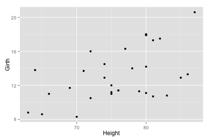

## Description

Application requirements:

1. Some form of input (widget: textbox, radio button, checkbox, ...)
2. Some operation on the ui input in sever.R
3. Some reactive output displayed as a result of server calculations
4. You must also include enough documentation so that a novice user could use your application.
5. The documentation should be at the Shiny website itself.

## Components

| Component |                      Description                      |
| :-------: | :---------------------------------------------------: |
|    ui.R   | user-interface definition of a Shiny web application. |
|  server.R | logic for a Shiny web application.                    |

--- 

## Functionality ui.R

In the ui.R the user has tow parts:

**1. Side Bar: has the option to choose:**
  - **Select a dataset**: iris, mtcars or trees.
  - **Select density**: from 50 to 250.
  - **Select a colour** for the graphs.
  - **Select one type of graph**: Bar Plot, Box Plot, Dot Plot, Line Chart, Scatter Plot.
  
**2. mainPanel: has a tabPanel with:**
  - **Dinamyc Information**: shows information (summary or structure) of the selected dataset.

---

## Server and Libraries

In the server.R are:

| Variable |                        Functionality                       |
| :------: | :--------------------------------------------------------: |
|   colm   | contains the value of selected dataset.                    |
|   var    | contains the names of the columns of the selected dataset. |
|  dataset | contains the selected dataset.                             |
|   graph  | contains the selected graphic.                             |

### Libraries:

`shiny` , `ggplot2`, `car`, `RcppEigen`

---

## Interactive Information 
<!--html_preserve--><div class="shiny-input-panel">
<div class="shiny-flow-layout">
<div>
<div class="form-group shiny-input-container">
<label class="control-label" for="n_breaks">Number of binds:</label>
<div>
<select id="n_breaks"><option value="10">10</option>
<option value="20" selected>20</option>
<option value="35">35</option>
<option value="50">50</option></select>
<script type="application/json" data-for="n_breaks" data-nonempty="">{}</script>
</div>
</div>
</div>
<div>
<div class="form-group shiny-input-container">
<label class="control-label" for="bw_adjust">Bandwith adjustment</label>
<input class="js-range-slider" id="bw_adjust" data-min="0.2" data-max="2" data-from="1" data-step="0.2" data-grid="true" data-grid-num="9" data-grid-snap="false" data-prettify-separator="," data-keyboard="true" data-keyboard-step="11.1111111111111"/>
</div>
</div>
</div>
</div><!--/html_preserve--><!--html_preserve--><div id="out9c951b56502d34d4" class="shiny-plot-output" style="width: 100% ; height: 400px"></div><!--/html_preserve-->

---

## Embedded Code

```r
library(ggplot2)
qplot(Height, Girth, data=trees) 
```

 
[Shiny Application](https://sigma360.shinyapps.io/shinyproject_coursera/)


